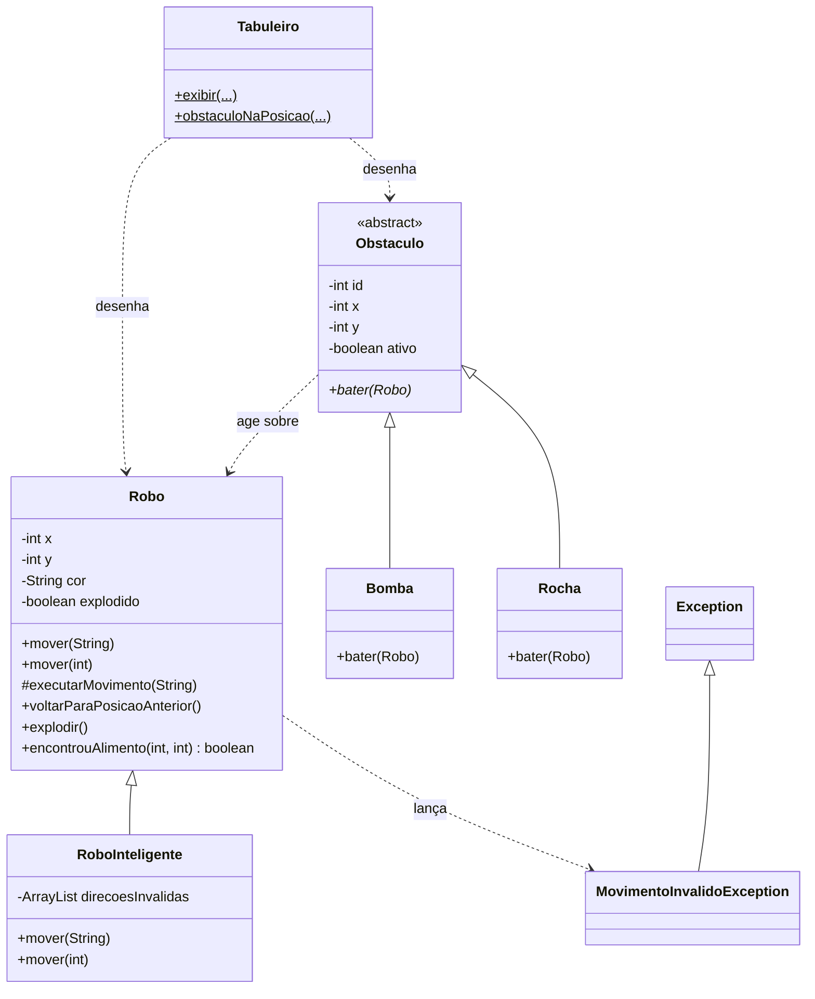

<div align="center">

# 🤖 Robô Simulador

### Dois robôs. Um alimento. Bombas, rochas e muita exceção para tratar.


</div>

---

## 🎮 O jogo em uma frase

Em um tabuleiro **4x4**, robôs partem de `(0,0)` em busca do alimento. Só que o caminho tem **paredes invisíveis** (movimentos inválidos que lançam exceções), **bombas** que explodem robôs e **rochas** que fazem o robô voltar um passo. Vence quem chegar primeiro, ou sobrevive quem não explodir.

Projeto desenvolvido para a disciplina de **Programação Orientada a Objetos**, com foco em **tratamento de exceções**, **herança**, **polimorfismo** e **classes abstratas**.

> 📸 *Coloque aqui um print ou GIF da interface gráfica rodando.*
> Exemplo: ``

---

## ✨ Destaques

| | Recurso | O que faz |
|---|---|---|
| 🚧 | **Exceção personalizada** | `MovimentoInvalidoException` impede o robô de sair do tabuleiro, e o jogo **não fecha** ao bater na parede |
| 🧠 | **Robô Inteligente** | Aprende com o erro: não repete uma direção que acabou de falhar |
| 💣 | **Bombas** | O robô que pisar explode e a bomba some do tabuleiro |
| 🪨 | **Rochas** | O robô que bater nelas volta para a posição anterior |
| 🖥️ | **Duas interfaces** | Matriz desenhada no console **e** janela gráfica com Swing |
| 🔁 | **Sobrecarga de métodos** | `mover("up")` ou `mover(1)`: as duas formas funcionam |

---

## 🗺️ Como ler o tabuleiro (console)

```
[ .  ][ .  ][ .  ][ *  ]
[ .  ][ R  ][ .  ][ .  ]
[ .  ][ .  ][ B  ][ .  ]
[ AV ][ .  ][ .  ][ .  ]
```

| Símbolo | Significado |
|:---:|---|
| `A`, `V` | Robôs (inicial da cor: **A**zul e **V**ermelho) |
| `*` | Alimento |
| `B` | Bomba |
| `R` | Rocha |
| `.` | Casa vazia |

As coordenadas vão de `0` a `3`. O eixo **y** cresce para cima: `up` soma 1 em y, `right` soma 1 em x.

---

## 🕹️ Os modos de jogo

| Classe | Modo | Descrição |
|---|---|---|
| `Main1` | 🧑 Manual | Você digita os movimentos e guia o robô até a comida |
| `Main2` | 🎲 Duelo aleatório | Dois robôs sorteiam movimentos, um de cada vez, até um achar o alimento |
| `Main3` | 🤖 Normal vs 🧠 Inteligente | Os dois buscam o alimento. No fim, compare quantos movimentos cada um gastou |
| `Main4` | 💥 Jogo completo | Você posiciona bombas e rochas. Termina quando um robô acha a comida **ou os dois explodem** |
| `JogoGrafico` | 🖥️ Interface gráfica | O jogo da `Main4` em uma janela, onde você monta o cenário **clicando** nas casas |

---

## 🧩 Arquitetura



### Conceitos de POO aplicados

- **Herança:** `RoboInteligente` estende `Robo`; `Bomba` e `Rocha` estendem `Obstaculo`.
- **Classe abstrata:** `Obstaculo` define o método `bater(Robo)`, e cada filha decide o efeito.
- **Polimorfismo:** o jogo chama `obstaculo.bater(robo)` sem saber se é bomba ou rocha.
- **Sobrecarga:** `mover(String)` e `mover(int)`.
- **Sobrescrita:** o robô inteligente reescreve os dois `mover`.
- **Encapsulamento:** atributos privados, acesso por getters e validação nos setters.
- **Exceção verificada (checked):** `MovimentoInvalidoException extends Exception` obriga quem chama a tratar com `try-catch`.

---

## 🚧 Tratamento de exceção na prática

O robô nunca se move para uma posição inválida. Ele **valida antes** e lança a exceção:

```java
try {
    robo.mover("left");           // robô em (0, y): sairia do tabuleiro
} catch (MovimentoInvalidoException e) {
    System.out.println("ERRO: " + e.getMessage());   // o jogo continua!
}
```

Casos que lançam `MovimentoInvalidoException`:

- Coordenada **negativa** ou **fora da área** 4x4
- Direção em texto desconhecida (ex.: `"diagonal"`)
- Código numérico fora de `1` a `4`

Em todos eles o robô **não se move** e o movimento é contado como inválido.

---

## 🧠 Como o Robô Inteligente "pensa"

O `RoboInteligente` guarda uma lista com as direções que **falharam desde o último movimento válido**.

1. Bateu na parede indo para `left`? A direção `left` entra na lista.
2. No próximo movimento, se o sorteio pedir `left` de novo, ele **troca** por outra direção que ainda não falhou.
3. Quando faz um movimento válido, a lista é **limpa** e ele recomeça sem preconceito.

Resultado: menos movimentos inválidos que o robô comum, e dá para comparar os dois na `Main3`.

---

## 🚀 Como executar

### Pelo NetBeans

1. Clone o repositório e abra a pasta como projeto Java.
2. Clique com o botão direito em `JogoGrafico.java` (ou em `Main1` a `Main4`) e escolha **Run File** (`Shift + F6`).

### Pelo terminal

Requer **JDK 17 ou superior**.

```bash
# compilar (na raiz do repositório)
javac -encoding UTF-8 -d out src/robosimulador/*.java

# jogar com interface gráfica
java -cp out robosimulador.JogoGrafico

# ou rodar um modo de console
java -cp out robosimulador.Main4
```

### Como jogar a versão gráfica

1. Clique em **Comida** e depois na casa onde ela ficará.
2. Clique em **Bomba** ou **Rocha** e depois nas casas onde quiser colocá-las.
3. Clique em **Iniciar** e acompanhe os robôs andando.
4. No final aparece um resumo com os movimentos de cada robô. **Reiniciar** limpa tudo.

---

## 📁 Estrutura do projeto

```
src/
└── robosimulador/
    ├── MovimentoInvalidoException.java   # exceção personalizada
    ├── Robo.java                         # robô base, regras de movimento
    ├── RoboInteligente.java              # robô que evita repetir erro
    ├── Obstaculo.java                    # classe abstrata
    ├── Bomba.java                        # robô explode
    ├── Rocha.java                        # robô volta uma casa
    ├── Tabuleiro.java                    # matriz 4x4 no console
    ├── Main1.java ... Main4.java         # modos de jogo no console
    └── JogoGrafico.java                  # interface gráfica (Swing)
```

---

## 👥 Equipe

| Integrante | Responsabilidades |
|---|---|
| **Pessoa 1** — *[seu colega aqui]* | Exceção, classe `Robo`, regras de movimento, `Main1` e `Main2` |
| **Pessoa 2** — *[seu nome aqui]* | `RoboInteligente`, obstáculos (`Bomba`, `Rocha`), `Tabuleiro`, `Main3`, `Main4` e interface gráfica |

---

## 🔮 Ideias para o futuro

- [ ] Tabuleiro de tamanho configurável
- [ ] Sprites para os robôs e os obstáculos
- [ ] Modo para dois jogadores humanos
- [ ] Placar com histórico das partidas
- [ ] Algoritmo de busca (BFS) para um robô ainda mais esperto

---

<div align="center">

Feito com ☕ e muitos `try-catch`.

</div>
